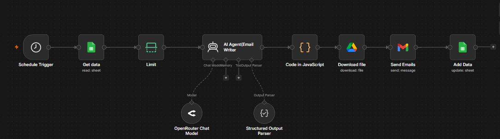

# AI Cold Email Automation Agent

An AI-powered email automation system built with **n8n**, **OpenRouter LLMs**, **Google Sheets**, and **Gmail**. The workflow automatically generates and sends personalized sales emails to potential clients, helping businesses promote their services at scale with minimal manual effort.

## 🚀 Features

* Sends 50+ personalized sales emails daily
* AI-generated email content using Large Language Models (LLMs)
* Reads prospect data directly from Google Sheets
* Automatically sends emails via Gmail
* Stores generated email content back into Google Sheets
* Fully automated workflow with scheduled execution
* Reduces manual outreach effort by approximately 90%
* Cost-efficient operation (~$0.02 per email)

## 🏗️ Workflow Architecture

  

 

1. **Schedule Trigger**

   * Starts the workflow automatically at predefined intervals.

2. **Google Sheets**

   * Reads company and prospect information from a spreadsheet.

3. **Limit Node**

   * Controls the number of records processed per execution.

4. **AI Agent (Email Writer)**

   * Uses an OpenRouter LLM to generate personalized outreach emails based on company information.

5. **JavaScript Processing**

   * Formats and structures the generated content.

6. **Google Drive**

   * Downloads supporting files or templates if required.

7. **Gmail**

   * Sends personalized sales emails to target companies.

8. **Google Sheets Update**

   * Saves generated email content and workflow status back into the spreadsheet.

## 🛠️ Tech Stack

* n8n
* OpenRouter
* Large Language Models (LLMs)
* Google Sheets API
* Gmail API
* Google Drive API
* JavaScript
* GCP

## 📈 Benefits

* Automates repetitive outreach tasks
* Generates highly personalized email content
* Maintains a complete record of all sent emails
* Improves lead generation efficiency
* Scalable and low-cost solution for sales teams

## 🎯 Use Cases

* AI Service Promotion
* Lead Generation Campaigns
* B2B Sales Outreach
* Customer Acquisition
* Marketing Automation

## Author

**Naveen Khan**
AI Engineer | Machine Learning | Generative AI | AI Automation
